# Claude Configuration Index
Last Updated: 2025-08-02T12:00:00+09:00

## Graph Structure

```mermaid
graph TD
    CLAUDE[CLAUDE.md] --> INIT[initialization.md]
    CLAUDE --> FS[file-system.md]
    CLAUDE --> TODO[todo-driven.md]
    CLAUDE --> THINK[thinking-principles.md]
    CLAUDE --> MCP[mcp-toolbox.md]
    CLAUDE --> WORK[workflow.md]
    CLAUDE --> PERSONA[persona-system.md]
    CLAUDE --> QUALITY[quality-standards.md]
    CLAUDE --> SESSION[session-management.md]
    CLAUDE --> QA[quality-assurance.md]
    CLAUDE --> ERROR[error-recovery.md]
    CLAUDE --> PATTERN[workflow-patterns.md]
    CLAUDE --> MEMORY[memory-system.md]
    CLAUDE --> GRAPH[graph-db-system.md]
    CLAUDE --> TOKEN[token-efficiency.md]
    
    MEMORY --> CTX[../claude-context.md]
    MEMORY --> LONG[../claude-memory.md]
    MEMORY --> CHECK[../claude-checkpoint-*.md]
```

## Configuration Files

1. **[[initialization.md]]** - 섹션 1: 자동 초기화 프로토콜
2. **[[file-system.md]]** - 섹션 2: Claude 파일 시스템
3. **[[todo-driven.md]]** - 섹션 3: TODO 주도 개발
4. **[[thinking-principles.md]]** - 섹션 4: 핵심 사고 원칙
5. **[[mcp-toolbox.md]]** - 섹션 5: MCP 도구 매핑
6. **[[workflow.md]]** - 섹션 6: 실행 워크플로우
7. **[[persona-system.md]]** - 섹션 7: 동적 페르소나
8. **[[quality-standards.md]]** - 섹션 8: 응답 품질 기준
9. **[[session-management.md]]** - 섹션 9: 세션 관리
10. **[[quality-assurance.md]]** - 섹션 10: 품질 보증
11. **[[error-recovery.md]]** - 섹션 11: 오류 복구
12. **[[workflow-patterns.md]]** - 섹션 12: 고급 워크플로우 패턴
13. **[[memory-system.md]]** - 섹션 15: Memento 컨텍스트 관리
14. **[[graph-db-system.md]]** - 섹션 16: Graph DB 문서 시스템
15. **[[token-efficiency.md]]** - 섹션 17: 토큰 효율성

## Quick Links

- Main: [[../CLAUDE.md]]
- Memory: [[../claude-memory.md]]
- Context: [[../claude-context.md]]