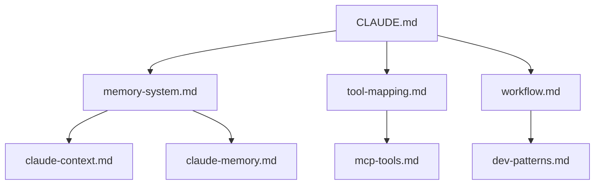

# Graph DB Documentation System
[[../CLAUDE.md#16]] → 이 파일로 이동됨

## 16. GRAPH DB DOCUMENTATION SYSTEM

### 문서가 너무 길어질 때 자동 분할

**분할 트리거:**
- CLAUDE.md > 500줄
- 섹션 하나 > 100줄
- 로딩 시간 > 2초

**분할 프로세스:**
```python
def split_documentation():
    1. Create ~/.claude/claude-config/
    2. Extract sections to separate files
    3. Create bidirectional links [[file#section]]
    4. Generate _index.md with graph visualization
    5. Update CLAUDE.md with links
```

**Graph Structure Example:**


**Link Format:**
- `[[memory-system.md]]` - 전체 파일 링크
- `[[memory-system.md#checkpoint]]` - 특정 섹션
- `[[../claude-memory.md]]` - 상위 디렉토리
- `{{include:memory-system.md#section}}` - 인라인 포함

### Auto-Organization Rules

1. **주제별 분리**: 각 주요 섹션은 독립 파일로
2. **크기 제한**: 파일당 최대 300줄
3. **상호 참조**: 모든 파일은 최소 2개 이상 링크
4. **인덱스 유지**: _index.md 자동 업데이트
5. **버전 관리**: 각 파일에 수정 이력 포함

## Implementation Status

### Current Structure
- ✅ claude-config/ 디렉토리 생성
- ✅ _index.md 인덱스 파일
- ✅ mcp-toolbox.md 분리
- ✅ memory-system.md 분리
- ✅ graph-db-system.md 분리
- ⏳ 추가 섹션 분리 예정

### Next Steps
1. 나머지 긴 섹션들 분리
2. 자동 분할 스크립트 작성
3. 링크 검증 도구 구현

## Related Links
- [[_index.md]] - 전체 구조 보기
- [[memory-system.md]] - 메모리 관리
- [[../CLAUDE.md]] - 메인 설정